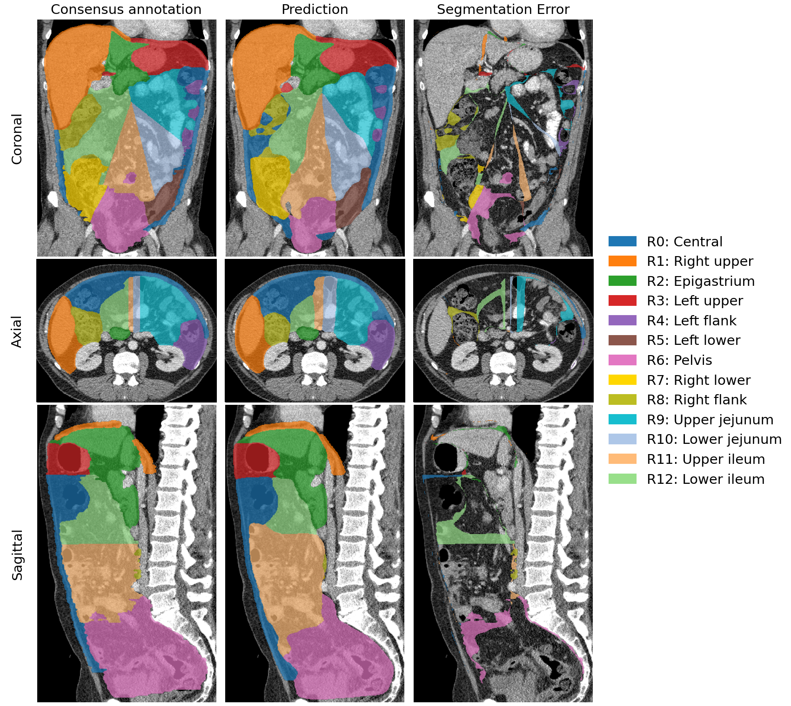

# Deep Learning–Based Segmentation of Radiological Peritoneal Cancer Index Regions

Automated CT segmentation of **radiological Peritoneal Cancer Index (rPCI) regions** using deep learning. This repository contains the code for training and evaluating segmentation models as described in our paper.

> **First model released:** pretrained nnU-Net weights for 13-region rPCI segmentation are available from the repository's [Releases](https://github.com/PieterGort/rpci-region-segmentation/releases) page.

> **Deep Learning–Based Segmentation of Radiological Peritoneal Cancer Index Regions in Abdominal Imaging**  
> Pieter C. Gort, Lotte J.S. Ewals, Marion W. Tops-Welten, Cris H.B. Claessens, Joost Nederend, Fons van der Sommen  
> *Department of Electrical Engineering, Eindhoven University of Technology & Catharina Hospital Eindhoven*

## Overview

Peritoneal metastases (PM) are currently assessed using diagnostic laparoscopy to determine Sugarbaker's Peritoneal Cancer Index (PCI), which divides the abdomen into **13 regions** and scores each based on tumor size. A recent [Delphi consensus study](https://doi.org/10.1007/s00330-025-11762-3) defined 3D regions for a **radiological PCI (rPCI)**, enabling standardized imaging-based assessment.

This repository provides:
- **SwinUNETR** implementation using MONAI
- **nnU-Net** training pipeline (following the [official nnU-Net framework](https://github.com/MIC-DKFZ/nnUNet))
- Released nnU-Net weights for 13-region rPCI segmentation
- Analysis scripts for computing segmentation metrics and interobserver variability
- Preprocessing and postprocessing utilities

### rPCI Regions (0–12)

| Region | Name | Region | Name |
|--------|------|--------|------|
| 0 | Central | 7 | Right lower |
| 1 | Right upper | 8 | Right flank |
| 2 | Epigastrium | 9 | Upper jejunum |
| 3 | Left upper | 10 | Lower jejunum |
| 4 | Left flank | 11 | Upper ileum |
| 5 | Left lower | 12 | Lower ileum |
| 6 | Pelvis | | |

## Results

Five-fold cross-validation on 62 CT scans with expert annotations showed:

| Method | Dice Score | HD95 (mm) | ASD (mm) |
|--------|------------|-----------|----------|
| Baseline nnU-Net | 0.81 ± 0.15 | 13.7 ± 10.8 | 4.1 ± 4.6 |
| **Anatomically constrained pipeline** | **0.84 ± 0.13** | **11.8 ± 9.4** | **3.4 ± 3.6** |

Swin UNETR reached an overall Dice score of 0.76 on the same 62-scan cross-validation cohort. As a separate clinical reference, interobserver agreement was measured in a 10-scan triple-annotation experiment, yielding Dice 0.87 ± 0.07, HD95 9.5 ± 6.5 mm, and ASD 3.0 ± 3.7 mm. These interobserver values contextualize the model results but are not pooled with the cross-validation experiment.

### Example Segmentation



The source CT scans, annotations, and exact cross-validation splits are not distributed with this repository because they contain confidential clinical data. This repository is intended as a research-methods reference: it documents the preprocessing, training, evaluation, and visualization code used in the study, but it is not a turnkey reproduction package with public data.

## Repository Structure

```
rpci-region-segmentation/
├── README.md                              # Project overview and usage examples
├── LICENSE                                # MIT license
├── requirements.txt                       # Python dependencies
├── setup.py                               # Package metadata and console entry points
├── Dockerfile                             # Optional container image definition
├── full_segmentation_analysis_3planes.png # Example segmentation figure
│
├── swinunetr/                             # SwinUNETR implementation (MONAI)
│   ├── __init__.py
│   ├── main.py                            # Training entry point
│   ├── train.py                           # Training and validation loops
│   ├── model.py                           # Model initialization and loading
│   ├── dataset.py                         # Data loading and split utilities
│   ├── predict.py                         # SwinUNETR inference script
│   └── utils.py                           # Plotting and logging helpers
│
├── nnunetv2/                              # nnU-Net v2 notes for this project
│   ├── __init__.py
│   └── README.md                          # nnU-Net setup guide
│
├── analysis/                              # Evaluation scripts
│   ├── __init__.py
│   ├── compute_metrics.py                 # Dice, HD95, ASD computation
│   └── observer_variability.py            # Interobserver agreement
│
├── preprocessing/                         # Data preprocessing
│   ├── __init__.py
│   ├── convert_to_nnunet.py               # Convert flat data to nnU-Net format
│   ├── crop_to_bounds.py                  # Crop images/segmentations to label bounds
│   └── dilate_segmentations.py            # Combine and expand segmentation masks
│
├── scripts/                               # Command-line workflow wrappers
│   ├── __init__.py
│   └── run_preprocessing.py               # End-to-end preprocessing wrapper
│
├── postprocessing/                        # Post-processing utilities
│   ├── __init__.py
│   ├── config.py                          # Region mappings for coarse postprocessing
│   ├── postprocess.py                     # Connected component filtering
│   ├── postprocess_coarse_segmentation.py # Convert Dataset401 outputs to 13 rPCI regions
│   └── resample_to_original.py            # Resample predictions to original image space
│
├── visualization/                         # Plotting utilities
│   ├── __init__.py
│   ├── plot_results.py                    # Lightweight segmentation overlays
│   └── visualization.py                   # Paper plotting utilities
│
├── configs/                               # Configuration files
│   └── swinunetr/default.yaml
│
├── docs/                                  # Documentation
│   ├── installation.md
│   └── data_format.md
│
└── experiments/
    └── __init__.py
```

## Quick Start

### Installation

```bash
# Clone the repository
git clone https://github.com/PieterGort/rpci-region-segmentation.git
cd rpci-region-segmentation

# Create conda environment
conda create -n rpci python=3.10
conda activate rpci

# Install PyTorch (adjust for your CUDA version)
pip install torch torchvision --index-url https://download.pytorch.org/whl/cu118

# Install dependencies
pip install -r requirements.txt
```

### Training with nnU-Net

For nnU-Net training, follow the [official nnU-Net documentation](https://github.com/MIC-DKFZ/nnUNet):

```bash
# 1. Install nnU-Net
pip install nnunetv2

# 2. Set environment variables
export nnUNet_raw="/path/to/nnUNet_raw"
export nnUNet_preprocessed="/path/to/nnUNet_preprocessed"
export nnUNet_results="/path/to/nnUNet_results"

# 3. Convert your data to nnU-Net format
python preprocessing/convert_to_nnunet.py \
    --images_dir /path/to/images \
    --segmentations_dir /path/to/labels \
    --output_dir $nnUNet_raw \
    --dataset_name Dataset001_rPCI

# 4. Plan and preprocess
nnUNetv2_plan_and_preprocess -d 001 --verify_dataset_integrity

# 5. Train (5-fold cross-validation)
nnUNetv2_train 001 3d_lowres 0
nnUNetv2_train 001 3d_lowres 1
nnUNetv2_train 001 3d_lowres 2
nnUNetv2_train 001 3d_lowres 3
nnUNetv2_train 001 3d_lowres 4
```

### Training with SwinUNETR

```bash
python -m swinunetr.main \
    --config configs/swinunetr/default.yaml \
    --data-dir /path/to/data \
    --results-dir ./results/swinunetr \
    --fold 0
```

Weights & Biases logging is disabled by default. To enable it, set `wandb.enabled: true` in `configs/swinunetr/default.yaml` and configure your W&B account outside the repository.

### Inference with nnU-Net

You can run inference with your own trained nnU-Net model or with the released rPCI segmentation models from the repository's [Releases](https://github.com/PieterGort/rpci-region-segmentation/releases) page.

To use released weights, install nnU-Net v2, configure the nnU-Net paths, download the model archive from the release page, and install it into your local nnU-Net results folder:

```bash
# Install nnU-Net v2
pip install nnunetv2

# Configure nnU-Net paths
export nnUNet_raw="/path/to/nnUNet_raw"
export nnUNet_preprocessed="/path/to/nnUNet_preprocessed"
export nnUNet_results="/path/to/nnUNet_results"

# Install the downloaded model archive into $nnUNet_results
nnUNetv2_install_pretrained_model_from_zip /path/to/downloaded_model.zip
```

Prepare input CT scans in nnU-Net inference format. For a single-channel CT model, each case should be named with the `_0000.nii.gz` channel suffix:

```text
/path/to/input_images/
├── case_001_0000.nii.gz
├── case_002_0000.nii.gz
└── ...
```

Run prediction with the trained or installed 5-fold model:

```bash
DATASET_ID=001  # Replace with the dataset id of the trained or installed model.

nnUNetv2_predict \
    -i /path/to/input_images \
    -o /path/to/output_segmentations \
    -d "$DATASET_ID" \
    -c 3d_lowres \
    -f 0 1 2 3 4
```

Use the dataset id and configuration associated with the trained or installed model.

For the `Dataset101_PM` model, the output segmentations use labels `0` for background and `1` to `13` for rPCI regions 0 to 12.

#### Dataset401 Coarse Model

The `Dataset401_PMSmallBowel` model predicts a coarser rPCI label set that merges anatomically related regions:

- `region45`: rPCI regions 4 and 5
- `region78`: rPCI regions 7 and 8
- `region9_12`: rPCI regions 9, 10, 11, and 12

This coarse model can improve segmentation robustness for boundaries that are difficult to distinguish directly on CT. To recover the 13 rPCI regions, postprocess the coarse predictions with the provided anatomically constrained postprocessing script.

```bash
# Predict coarse regions after installing Dataset401_PMSmallBowel.zip
nnUNetv2_predict \
    -i /path/to/input_images \
    -o /path/to/coarse_output_segmentations \
    -d 401 \
    -c 3d_lowres \
    -f 0 1 2 3 4

# Convert coarse predictions back to 13 rPCI regions.
# This uses TotalSegmentator masks for hip, duodenum, and small-bowel anatomy.
python -m postprocessing.postprocess_coarse_segmentation \
    --input_folder /path/to/coarse_output_segmentations \
    --scan_folder /path/to/input_images \
    --output_folder /path/to/postprocessed_13_region_segmentations \
    --run_totalsegmentator
```

If TotalSegmentator masks have already been computed, pass their folder with `--totalseg_folder` instead of `--run_totalsegmentator`.

### Evaluation

Compute segmentation metrics (Dice, HD95, ASD):

```bash
python analysis/compute_metrics.py \
    --gt-folder /path/to/ground_truth \
    --pred-folder /path/to/predictions \
    --output-dir ./results/metrics
```

Compute interobserver variability:

```bash
python analysis/observer_variability.py \
    --segmentations-folder /path/to/multi_observer_annotations
```

## Data Format

### Input Data Structure

```
/path/to/data/
├── Scan_001.nii.gz                         # CT scan (portal venous phase)
├── Scan_002.nii.gz
├── Segmentations_001.nii.gz               # rPCI region labels (0-13)
├── Segmentations_002.nii.gz
└── ...
```

Use the same case identifier in each image/segmentation pair: `Scan_{case_id}.nii.gz` and `Segmentations_{case_id}.nii.gz`. If you run the provided raw-data dilation pipeline, its processed labels are saved as `Segmentations_{case_id}_all_expanded.nii.gz`.

### Label Encoding

| Label | Region Name |
|-------|-------------|
| 0 | Background |
| 1 | Region 0 (Central) |
| 2 | Region 1 (Right upper) |
| ... | ... |
| 13 | Region 12 (Lower ileum) |

## Preprocessing Pipeline

1. **Expand and combine segmentation masks** by 2mm (compensate for under-segmentation)
2. **Optionally crop to segmentation bounds** with a configurable voxel/slice margin
3. **Convert to nnU-Net format** (or use the processed folder with SwinUNETR)

The dilation step is part of the preprocessing used for the reported experiments and can materially affect the training labels. If your labels are already finalized NIfTI masks, document whether they are raw or expanded and keep the naming consistent with the data format section.

```bash
# Full preprocessing pipeline
python scripts/run_preprocessing.py \
    --input-folder /path/to/raw_data \
    --output-folder /path/to/processed_data \
    --expansion 2 \
    --crop-margin 5

python preprocessing/convert_to_nnunet.py \
    --images_dir /path/to/processed_data \
    --segmentations_dir /path/to/processed_data \
    --output_dir /path/to/nnUNet_raw \
    --dataset_name Dataset001_rPCI
```

## Citation

If you use this code in your research, please cite:

```bibtex
@article{gort2026rpci,
  title={Deep Learning–Based Segmentation of Radiological Peritoneal Cancer Index Regions in Abdominal Imaging},
  author={Gort, Pieter C. and Ewals, Lotte J.S. and Tops-Welten, Marion W. and Claessens, Cris H.B. and Nederend, Joost and van der Sommen, Fons},
  journal={International Journal of Computer Assisted Radiology and Surgery},
  year={2026}
}
```

Please also cite nnU-Net, which this repository builds on, and the Delphi study that defined the imaging-based rPCI region boundaries:

**nnU-Net:**
```bibtex
@article{Isensee2018NnU-Net:Segmentation,
    title = {{nnU-Net: Self-adapting Framework for U-Net-Based Medical Image Segmentation}},
    year = {2018},
    journal = {Informatik aktuell},
    author = {Isensee, Fabian and Petersen, Jens and Klein, Andre and Zimmerer, David and Jaeger, Paul F. and Kohl, Simon and Wasserthal, Jakob and Koehler, Gregor and Norajitra, Tobias and Wirkert, Sebastian and Maier-Hein, Klaus H.},
    month = {9},
    pages = {22},
    publisher = {Springer Berlin Heidelberg},
    url = {https://arxiv.org/abs/1809.10486v1},
    isbn = {9783658253257},
    doi = {10.1007/978-3-658-25326-4\_7},
    issn = {1431472X},
    arxivId = {1809.10486}
}
```

**rPCI Region Definitions:**
```bibtex
@article{Tops-Welten2025DefiningStudy,
    title = {{Defining region boundaries to assess the peritoneal cancer index on imaging: a Delphi study}},
    year = {2025},
    journal = {European Radiology 2025},
    author = {Tops-Welten, Marion W. and Ewals, Lotte J. S. and van Hellemond, Irene E. G. and Piek, Jurgen M. J. and Lahaye, Max J. and De Hingh, Ignace H. J. T. and Nederend, Joost and Luyer, Misha D. P.},
    month = {6},
    pages = {1--11},
    publisher = {Springer},
    url = {https://link.springer.com/article/10.1007/s00330-025-11762-3},
    doi = {10.1007/S00330-025-11762-3},
    issn = {1432-1084}
}
```

## License

This project is licensed under the MIT License - see the [LICENSE](LICENSE) file for details.

## Acknowledgements

- [nnU-Net](https://github.com/MIC-DKFZ/nnUNet) - Self-configuring medical image segmentation
- [MONAI](https://monai.io/) - Medical Open Network for Artificial Intelligence
- [SwinUNETR](https://arxiv.org/abs/2201.01266) - Swin Transformers for medical imaging
- Catharina Cancer Institute, Catharina Hospital Eindhoven
- Hanarth Fund for supporting AI research in oncology
- SURF for access to the Snellius supercomputer

## Contact

For questions or issues, please open a GitHub issue or contact:
- Pieter Gort: p.c.gort@tue.nl
